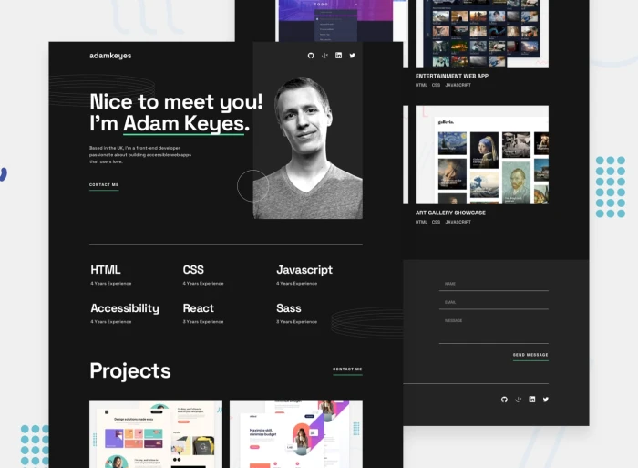

# Frontend Mentor - Single-page developer portfolio solution


This is a solution to the [Single-page developer portfolio challenge on Frontend Mentor](https://www.frontendmentor.io/challenges/singlepage-developer-portfolio-bBVj2ZPi-x). Frontend Mentor challenges help you improve your coding skills by building realistic projects. 

# Table of contents
#### [The challenge](#the-challenge) |   [Screenshots](#screenshots) | [Links](#links) | [Built with](#built-with) | [What I learned](#what-i-learned) | [Continued development](#continued-development) | [Useful resources](#useful-resources) | [Author](#author)


## The challenge

Users should be able to:

- [x] Receive an error message when the `form` is submitted if:
  - [x] Any field is empty
  - [x] The email address is not formatted correctly
- [x] View the optimal layout for the interface depending on their device's screen size:
  - [x] Mobile @ 375px
  - [x] Tablet @ 768px
  - [x] Desktop @ 1220px
- [x] See hover and focus states for all interactive elements on the page
- [ ] **Bonus**: Hook the form up so it sends and stores the user's enquiry (you can use a spreadsheet or Airtable to save the enquiries)
- [x] **Bonus**: Add your own details (image, skills, projects) to replace the ones in the design
<!-- TO-Do => update project img's with view port resize -->
<!-- TO-DO => See hover and focus states for all interactive elements on the page -->
<!-- TO-DO => Hook the form up so it sends and stores the user's enquiry (you can use a spreadsheet or Airtable to save the enquiries) -->
<!-- TO-DO => Accessibility -->
<!-- TO-DO => Deploy -->

## Screenshots


## Links

- Solution URL: [here](https://github.com/Chanda-Abdul/Single-page-developer-portfolio-Frontend-Mentor)
- Live Site URL: [here](https://keen-bavarois-14c4e7.netlify.app/)


## Built with


## What I learned

<!-- Use this section to recap over some of your major learnings while working through this project. Writing these out and providing code samples of areas you want to highlight is a great way to reinforce your own knowledge.

To see how you can add code snippets, see below:

```html
<h1>Some HTML code I'm proud of</h1>
```
```css
.proud-of-this-css {
  color: papayawhip;
}
```
```js
const proudOfThisFunc = () => {
  console.log('🎉')
}
```

 -->


## Continued development

<!-- Use this section to outline areas that you want to continue focusing on in future projects. These could be concepts you're still not completely comfortable with or techniques you found useful that you want to refine and perfect. -->


## Useful resources

- [Building a portfolio website with HTML & CSS | Part 1](https://youtu.be/65GVcdESj3s) - This helped me for XYZ reason. I really liked this pattern and will use it going forward.
- [Client-side form validation](https://developer.mozilla.org/en-US/docs/Learn/Forms/Form_validation#validating_forms_using_javascript) - This is an amazing article which helped me finally understand XYZ. I'd recommend it to anyone still learning this concept.


## Author

- Frontend Mentor - [@Chanda-Abdul](https://www.frontendmentor.io/profile/Chanda-Abdul)
- Website - [Chanda Codes](https://chandacodes.com/)
- GitHub - [github.com/Chanda-Abdul](https://github.com/Chanda-Abdul)


